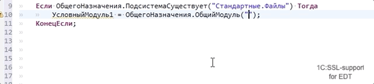
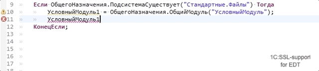
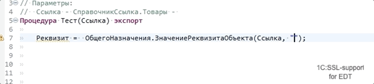
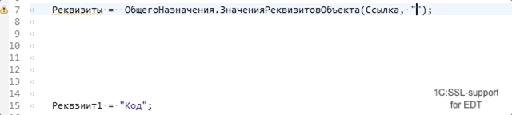

# 1C:SSL support for 1C:EDT

Расширение для 1C:EDT позволяющее разрабатывать конфигурации на основе библиотеки 1С:БСП (Библиотека Стандартных Подсистем, Standard Subsystems Library) с бОльшим комфортом.

## Основные возможности

Поддержка контент-ассиста в строковых литералах, гиперссылки для перехода или по F3:

* `ОбщегоНазначения.ПодсистемаСуществует` (`Common.SubsystemExist`) - иерархические имена подсистем

* `ОбщегоНазначения.ОбщийМодуль` (`Common.CommonModule`) - имена общих модулей и модулей менеджеров

* `ОбщегоНазначения.ЗначениеРеквизитаОбъекта` (`Common.ObjectAttributeValue`) - иерархическое имя реквизита из указанных ссылочных типов
* `ОбщегоНазначения.ЗначениеРеквизитаОбъектов` (`Common.ObjectsAttributeValue`) - иерархическое имя реквизита из указанных ссылочных типов в массиве
* `ОбщегоНазначенияКлиент.ОбщийМодуль` (`CommonClient.CommonModule`) - имена общих модулей и модулей менеджеров
* `ОбщегоНазначенияКлиент.ПодсистемаСуществует` (`CommonClient.SubsystemExist`) - иерархические имена подсистем

Позволяет налету вычислять функции общего модуля `ОбщегоНазначения` (`Common`) которые возвращают тип в зависимости от переданных параметров.

* `ОбщийМодуль` (`CommonModule`) - функция возвращает конкретный тип модуля, это позволяет вызвать методы модуля, получать типы возвращаемых значений, строить иерархию вызовов с учетом условных вызовов частичного внедрения БСП.

* `МенеджерОбъектаПоСсылке` (`ObjectManagerByRef`) - функция возвращает конкретный тип модуля менеджера по ссылке
* `МенеджерОбъектаПоПолномуИмени` (`ObjectManagerByFullName`) - функция возвращает конкретный тип модуля менеджера по полному имени
* `ЗначениеРеквизитаОбъекта` (`ObjectAttributeValue`) - функция возвращает конкретный тип по типу реквизита передаваемого в параметрах

* `ЗначениеРеквизитаОбъектов` (`ObjectsAttributeValue`) - функция возвращает конкретный тип реквизита объекта метаданных
* `ЗначенияРеквизитовОбъекта` (`ObjectAttributesValues`) - функция возвращает тип со структурой и типизированными свойствами по именам реквизитов

* `ЗначенияРеквизитовОбъектов` (`ObjectsAttributesValues`) - функция возвращает конкретный тип реквизита объекта метаданных
* `ОписаниеСвойствОбъекта` (`ObjectPropertiesDetails`) - возвращает таблицу с типизированными колонками
* (планируется) `ТаблицаЗначенийВМассив` (`ValueTableToArray`) - возвращает массив из структур с со свойствами идентичными колонкам таблицы
* 'СтрокаТаблицыЗначенийВСтруктуру' ('ValueTableRowToStructure') - возвращает структуру со свойствами идентичными колонкам таблицы

Позволяет налету вычислять функции общего модуля `ОбщегоНазначенияКлииент` (`CommonClient`)

* `ОбщийМодуль` (`CommonModule`) - функция возвращает конкретный тип модуля

> Для функций поддерживается вычисление контента строк переданных через локальные  переменные, с вычислением бинарных операций (конкатенация строк) в рамках одной процедуры. Для функции `ЗначенияРеквизитовОбъекта` (`ObjectAttributesValues`) поддерживается вычисление значений элементов массивов, значений ключей структуры.

## Установка

1C:SSL support поставляется в виде репозитория Eclipse. Установка расширения может выполняться следующими способами:

- непосредственно из p2-репозитория, опубликованного на серверах фирмы 1С.
- из локальной копии p2-репозитория, распакованного в локальную папку из предварительно скачанного zip-архива.

В строку выбора репозитория  для установки (`Work with`) вставьте адрес репозитория:

| Версия | P2-репозиторий | ZIP-архив репозитория |
|--------|----------------|-----------------------|
| 0.1.0 для 1C:EDT 2020.3 | https://edt.1c.ru/releases/plugins/ssl-support/edt-1.19.0/0.1.0/repo/ | https://edt.1c.ru/releases/plugins/ssl-support/edt-1.19.0/0.1.0/repo.zip |
| 0.1.1 для 1C:EDT 2020.4 | https://edt.1c.ru/releases/plugins/ssl-support/edt-2020.4.0/0.1.1/repo/ | https://edt.1c.ru/releases/plugins/ssl-support/edt-2020.4.0/0.1.1/repo.zip |
| 0.2.0 для 1C:EDT 2020.5 | https://edt.1c.ru/releases/plugins/ssl-support/edt-2020.5.0/0.2.0/repo/ | https://edt.1c.ru/releases/plugins/ssl-support/edt-2020.5.0/0.2.0/repo.zip |
| 0.3.0 для 1C:EDT 2020.6 | https://edt.1c.ru/releases/plugins/ssl-support/edt-2020.6/0.3.0/repo/ | https://edt.1c.ru/releases/plugins/ssl-support/edt-2020.6/0.3.0/repo.zip |
| 0.4.0 для 1C:EDT 2021.1 | https://edt.1c.ru/releases/plugins/ssl-support/edt-2021.1/0.4.0/repo/ | https://edt.1c.ru/releases/plugins/ssl-support/edt-2021.1/0.4.0/repo.zip |

Для входа на сайт https://edt.1c.ru используйте логин и пароль сайта https://its.1c.ru/ .

Далее для установки нужно выполнить следующие действия:

- В среде разработки 1C:Enterprise Development Tools (EDT) выберите пункт меню Help – Install New Software (Справка – Установить новое ПО).
- В открывшемся окне мастера установки в строке Work with воспользуйтесь кнопкой Add… и укажите расположение репозитория.
- Если установка производится непосредственно из репозитория, опубликованного на серверах фирмы 1С, то скопируйте указанный адрес репозитория, а также и логин и пароль с сайта
- Если установка производится из локальной папки, то воспользуйтесь кнопкой Local.. и далее по кнопке Local укажите папку, в которую распакован репозиторий.
- Отметьте компонент 1C:SSL-support и нажмите кнопку Next>
- На следующем шаге система определит зависимости и сформирует окончательный список библиотек к установке, после этого нажмите кнопку Next>
- Прочитайте и примите условия лицензионного соглашения и нажмите кнопку Finish
- Дождитесь окончания установки и перезапустите среду 1C:Enterprise Development Tools. Установка завершена.

## Участие в проекте

Добро пожаловать! [См. правила в соответствующем разделе](CONTRIBUTING.md)

## Лицензия

Лицензирование расширений размещенных в данном проекте осуществляется на условиях свободной (открытой) лицензии Eclipse Public License - v 2.0 (полный текст лицензии - https://www.eclipse.org/legal/epl-2.0/)

Это означает, что:
- Вы можете  свободно и бесплатно заимствовать код  и помещать  его в свои проекты, учитывая  однако, что  такой  код не становится вашей интеллектуальной собственностью, Вы лишь  получаете  неисключительные права его использования с учетом рамок и ограничений,  описанных  в EPL 2.0 
- Внося изменения в расширение, модифицируя и дорабатывая его, а также объединяя файлы расширения с иными материалами, не относящимися к расширению (далее по тексту как «результаты работ»), Вы также обязаны публиковать это  обновленный код на условиях EPL 2.0, т.е. автоматически предоставляете любым третьим лицам, включая ООО «1С-Софт» и иных контрибьюторов, безвозмездное право использования результатов Ваших работ на территории стран всего мира на условиях открытой лицензии EPL 2.0. 

Публикуя свои разработки, доработки и исправления к программам  других авторов Вы также подтверждаете, что:
- являетесь единственным автором и обладателем имущественного права на результаты работ; в случае, если обладателем имущественного права на результаты работ является Ваш работодатель, Вы гарантируете наличие его согласия на публикацию кода на условиях открытой лицензии EPL 2.0;
- Вы снабдили  результаты Ваших работ всеми необходимыми уведомлениями,  свидетельствующими о том, что они подчиняются открытой лицензии EPL 2.0;
- Результаты Ваших работ доступны в виде исходного кода, или Вы обязуетесь сообщить, каким образом третьи лица без существенных затрат могут получить результаты Ваших работ в виде исходного кода; 
- Все имеющиеся ранее уведомления других авторов (license notices) не были Вами удалены или изменены, а указанные Вами уведомления отражают достоверную информацию о Вас как правообладателе Вашего оригинального кода (включая ФИО или наименование организации-работодателя)

Пояснения выше приведены исключительно для удобства восприятия основных положений лицензии EPL 2.0. и не заменяет содержание понятий, приведенных по тексту лицензионного соглашения. Для более детального понимания Ваших прав и обязанностей рекомендуем ознакомиться с полным текстом открытой лицензии EPL 2.0.

