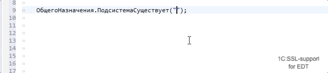
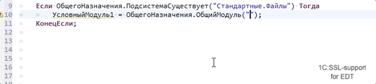
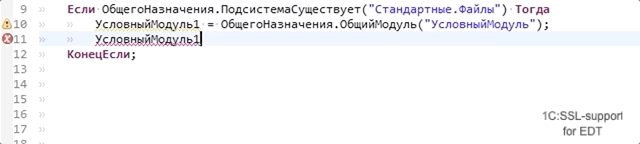
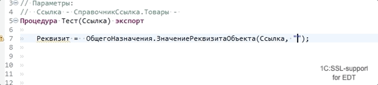
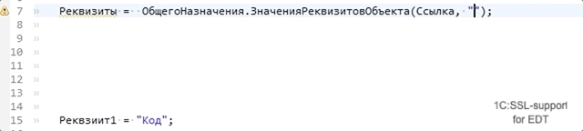

# 1C:SSL support for 1C:EDT

Расширение для 1C:EDT позволяющее разрабатывать конфигурации на основе библиотеки 1С:БСП (Библиотека Стандартных Подсистем, Standard Subsystems Library) с бОльшим комфортом.

## Основные возможности

Поддержка контент-ассиста в строковых литералах, гиперссылки для перехода или по F3:

* `ОбщегоНазначения.ПодсистемаСуществует` (`Common.SubsystemExist`) - иерархические имена подсистем

* `ОбщегоНазначения.ОбщийМодуль` (`Common.CommonModule`) - имена общих модулей и модулей менеджеров

* `ОбщегоНазначения.ЗначениеРеквизитаОбъекта` (`Common.ObjectAttributeValue`) - иерархическое имя реквизита из указанных ссылочных типов
* `ОбщегоНазначения.ЗначениеРеквизитаОбъектов` (`Common.ObjectsAttributeValue`) - иерархическое имя реквизита из указанных ссылочных типов в массиве
* `ОбщегоНазначенияКлиент.ОбщийМодуль` (`CommonClient.CommonModule`) - имена общих модулей и модулей менеджеров
* `ОбщегоНазначенияКлиент.ПодсистемаСуществует` (`CommonClient.SubsystemExist`) - иерархические имена подсистем

Позволяет налету вычислять функции общего модуля `ОбщегоНазначения` (`Common`) которые возвращают тип в зависимости от переданных параметров.

* `ОбщийМодуль` (`CommonModule`) - функция возвращает конкретный тип модуля, это позволяет вызвать методы модуля, получать типы возвращаемых значений, строить иерархию вызовов с учетом условных вызовов частичного внедрения БСП.

* `МенеджерОбъектаПоСсылке` (`ObjectManagerByRef`) - функция возвращает конкретный тип модуля менеджера по ссылке
* `МенеджерОбъектаПоПолномуИмени` (`ObjectManagerByFullName`) - функция возвращает конкретный тип модуля менеджера по полному имени
* `ЗначениеРеквизитаОбъекта` (`ObjectAttributeValue`) - функция возвращает конкретный тип по типу реквизита передаваемого в параметрах

* `ЗначениеРеквизитаОбъектов` (`ObjectsAttributeValue`) - функция возвращает конкретный тип реквизита объекта метаданных
* `ЗначенияРеквизитовОбъекта` (`ObjectAttributesValues`) - функция возвращает тип со структурой и типизированными свойствами по именам реквизитов

* `ЗначенияРеквизитовОбъектов` (`ObjectsAttributesValues`) - функция возвращает конкретный тип реквизита объекта метаданных
* `ОписаниеСвойствОбъекта` (`ObjectPropertiesDetails`) - возвращает таблицу с типизированными колонками
* (планируется) `ТаблицаЗначенийВМассив` (`ValueTableToArray`) - возвращает массив из структур с со свойствами идентичными колонкам таблицы
* 'СтрокаТаблицыЗначенийВСтруктуру' ('ValueTableRowToStructure') - возвращает структуру со свойствами идентичными колонкам таблицы

Позволяет налету вычислять функции общего модуля `ОбщегоНазначенияКлииент` (`CommonClient`)

* `ОбщийМодуль` (`CommonModule`) - функция возвращает конкретный тип модуля

> Для функций поддерживается вычисление контента строк переданных через локальные переменные, с вычислением бинарных операций (конкатенация строк) в рамках одной процедуры. Для функции `ЗначенияРеквизитовОбъекта` (`ObjectAttributesValues`) поддерживается вычисление значений элементов массивов, значений ключей структуры.

