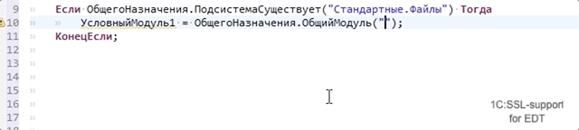

# `ОбщегоНазначения.ОбщийМодуль` (`Common.CommonModule`)

Описание функции:

> Функция возвращает ссылку на общий модуль или модуль менеджера по имени.

## Помощник ввода в строковых литералах

- Поддержка помощника ввода в строковом литералае подсказывает имена общих модулей 
- Поддержка ввода полного имени модуля менеджера
- Гиперссылки для перехода при нажатии Ctrl+Click или по F3 





Пример:

```bsl
МодульПолнотекстовыйПоискКлиент = ОбщегоНазначения.ОбщийМодуль("Полнот<Cltl+Space>");
```


## Типизация возвращаемых значений

Функция возвращает конкретный тип модуля, это позволяет вызвать методы модуля, получать типы возвращаемых значений, строить иерархию вызовов с учетом условных вызовов частичного внедрения БСП.


Пример:

```bsl
	Если ОбщегоНазначения.ПодсистемаСуществует("СтандартныеПодсистемы.ОбновлениеКонфигурации") Тогда
		МодульОбновлениеКонфигурации = ОбщегоНазначения.ОбщийМодуль("ОбновлениеКонфигурации");
		МодульОбновлениеКонфигурации.<Имя метода>();
	КонецЕсли;

	Если ОбщегоНазначения.ПодсистемаСуществует("СтандартныеПодсистемы.ПолнотекстовыйПоиск") Тогда
		МодульПолнотекстовыйПоискСервер = ОбщегоНазначения.ОбщийМодуль("ПолнотекстовыйПоискСервер");
		МодульПолнотекстовыйПоискСервер.<Имя метода>();
	КонецЕсли;
```


Пример:

```bsl
Процедура Тест() экспорт
	
	Модуль = ОбщегоНазначения.ОбщийМодуль("УсловныйМодуль");
	Если Модуль.ТестоваяФункция().Отказ Тогда
		Возврат;
	КонецЕсли;

КонецПроцедуры
```


### Вычисление значений параметров

Для функций поддерживается вычисление контента строк переданных через локальные переменные, с вычислением бинарных операций (конкатенация строк) в рамках одной процедуры.


Пример 2:


```bsl
ИмяМодуля = "ПолнотекстовыйПоискКлиент";
МодульПолнотекстовыйПоискКлиент = ОбщегоНазначения.ОбщийМодуль(ИмяМодуля);
```


Пример 2:

```bsl
Процедура Тест() экспорт
	
	ИмяМодуля = "УсловныйМодуль";
	Модуль = ОбщегоНазначения.ОбщийМодуль(ИмяМодуля);
	Если Модуль.ТестоваяФункция().Отказ Тогда
		Возврат;
	КонецЕсли;

КонецПроцедуры
```


Пример 3:

```bsl
Процедура Тест() экспорт
	
	КлассОМД = "РегистрСведений";
	ИмяОМД = "ШтрихКоды"
	ИмяМодуля = КлассОМД + "." + ИмяОМД;
	
	Модуль = ОбщегоНазначения.ОбщийМодуль(ИмяМодуля);
	
	Модуль.ШтрихКод(); // Вызываемая фнукция

КонецПроцедуры
```

