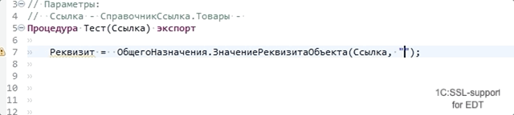

# `ОбщегоНазначения.ЗначениеРеквизитаОбъекта` (`Common.ObjectAttributeValue`) 

Описание функции:

> Значение реквизита, прочитанного из информационной базы по ссылке на объект.
>
> Если необходимо зачитать реквизит независимо от прав текущего пользователя,
> то следует использовать предварительный переход в привилегированный режим.

## Помощник ввода в строковых литералах

- Поддержка ввода имени реквизита из указанных ссылочных типов
- Возможность ввода ерархического имени реквизита
- Гиперссылки для перехода при нажатии Ctrl+Click или по F3 


Пример:

```bsl
// Параметры:
//  Ссылка - СправочникСсылка.Товары - 
Процедура Тест(Ссылка) экспорт
	
	Результат = ОбщегоНазначения.ЗначениеРеквизитаОбъекта(Ссылка, "Поставщик.Ссылка.Ро<Ctrl+Space>");

КонецПроцедуры

```


## Типизация возвращаемых значений

Функция возвращает конкретный тип по типу реквизита передаваемого в параметрах
 



Пример:

```bsl
// Параметры:
//  Ссылка - СправочникСсылка.Товары - 
Процедура Тест(Ссылка) экспорт
	
	Результат = ОбщегоНазначения.ЗначениеРеквизитаОбъекта(Ссылка, "Поставщик");
	УИ = Результат.УникальныйИдентификатор();

КонецПроцедуры

```


### Вычисление значений параметров

Для функций поддерживается вычисление контента строк переданных через локальные переменные, с вычислением бинарных операций (конкатенация строк) в рамках одной процедуры.

```bsl
// Параметры:
//  Ссылка - СправочникСсылка.Товары - 
Процедура Тест(Ссылка) экспорт
	
	ИмяРеквизитаПоставщика = "Поставщик";
	Путь = ИмяРеквизитаПоставщика + ".Ссылка.Родитель";
	Результат = ОбщегоНазначения.ЗначениеРеквизитаОбъекта(Ссылка, Путь);

КонецПроцедуры

```
