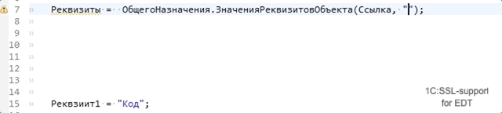

# `ОбщегоНазначения.ЗначенияРеквизитовОбъекта` (`Common.ObjectAttributesValues`) 

Описание функции:

> Структура, содержащая значения реквизитов, прочитанные из информационной базы по ссылке на объект.
>
> Если необходимо зачитать реквизит независимо от прав текущего пользователя,
> то следует использовать предварительный переход в привилегированный режим.


## Типизация возвращаемых значений


Функция возвращает тип со структурой и типизированными свойствами по именам реквизитов




Пример:

```bsl
// Параметры:
//  Ссылка - СправочникСсылка.Товары - 
Процедура Тест(Ссылка) экспорт
	
	Результат = ОбщегоНазначения.ЗначенияРеквизитовОбъекта(Ссылка, "Поставщик, Родитель, Ссылка"); 
	Поставщик = Результат.Поставщик;
	Родитель = Результат.Родитель;
	
КонецПроцедуры
```

### Вычисление значений параметров

Для функций поддерживается вычисление контента строк переданных через локальные переменные, с вычислением бинарных операций (конкатенация строк) в рамках одной процедуры.
Поддерживается вычисление значений элементов массивов, значений ключей структуры.


Пример:

```bsl
// Параметры:
//  Ссылка - СправочникСсылка.Товары - 
Процедура Тест(Ссылка) экспорт
	
	ИмяРеквзита = "Поставщик";
	ИменаРеквизитов = Новый Массив("Родитель");
	ИменаРеквизитов.Добавить(ИмяРеквзита);
	ИменаРеквизитов.Добавить();
	ИменаРеквизитов.Добавить("Ссылка");
	Результат = ОбщегоНазначения.ЗначенияРеквизитовОбъекта(Ссылка, ИменаРеквизитов);
	
КонецПроцедуры
```

Пример 2:

```bsl
// Параметры:
//  Ссылка - СправочникСсылка.Товары - 
Процедура Тест(Ссылка) экспорт
	
	ИмяРеквзита = "Поставщик";
	Результат = ОбщегоНазначения.ЗначенияРеквизитовОбъекта(Ссылка, Новый Массив(ИмяРеквзита, "Родитель", "Ссылка"));
	
КонецПроцедуры
```

Пример 3:

```bsl
// Параметры:
//  Ссылка - СправочникСсылка.Товары - 
Процедура Тест(Ссылка) экспорт
	
	ИмяРеквзита = "Поставщик.Код";
	Результат = ОбщегоНазначения.ЗначенияРеквизитовОбъекта(Ссылка, Новый Массив(ИмяРеквзита, "Родитель.Ссылка", "Ссылка"));
	
КонецПроцедуры
```

Пример 4:

```bsl
// Параметры:
//  Ссылка - СправочникСсылка.Товары - 
Процедура Тест(Ссылка) экспорт
	
	Реквзиит1 = "Код";
	
	ИменаРеквизитов = "Поставщик";
	ИменаРеквизитов = "Ссылка";
	ИменаРеквизитов = ИменаРеквизитов + ", Родитель" + "," + Реквзиит1;
	Результат = ОбщегоНазначения.ЗначенияРеквизитовОбъекта(Ссылка, ИменаРеквизитов + ", Наименование"); 
	
КонецПроцедуры
```

Пример 5:

```bsl
// Параметры:
//  Ссылка - СправочникСсылка.Товары - 
Процедура Тест(Ссылка) экспорт
	
	ИмяРеквзита = "Поставщик";
	ИменаРеквизитов = Новый Структура;
	ИменаРеквизитов.Вставить(ИмяРеквзита);
	ИменаРеквизитов.Вставить("Родитель");
	ИменаРеквизитов.Вставить("Ссылка");
	Результат = ОбщегоНазначения.ЗначенияРеквизитовОбъекта(Ссылка, ИменаРеквизитов);
	
КонецПроцедуры
```


