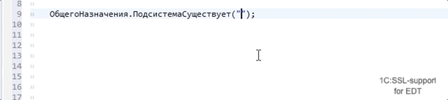

# `ОбщегоНазначения.ПодсистемаСуществует` (`Common.SubsystemExist`)

Описание функции:

> Возвращает Истина, если функциональная подсистема существует в конфигурации.
> Предназначена для реализации вызова необязательной подсистемы (условного вызова).
> У функциональной подсистемы снят флажок "Включать в командный интерфейс".
> См. также ОбщегоНазначенияПереопределяемый.ПриОпределенииОтключенныхПодсистем
> и ОбщегоНазначенияКлиент.ПодсистемаСуществует для вызова из клиентского кода.

## Помощник ввода в строковых литералах

- Поддержка помощника ввода в строковом литералае подсказывает имена подсистем
- Возможность ввода иерархических имен подсистем
- Гиперссылки для перехода при нажатии Ctrl+Click или по F3

